# Employee Management System

The Employee Management System is a comprehensive solution designed to streamline and enhance human resource operations within organizations. This system offers a user-friendly interface that facilitates efficient management of employee profiles, tracking of leave and attendance, task assignment, and performance evaluations. By centralizing these essential HR functions, the system empowers administrators to optimize workforce management, boost productivity, and ensure accurate data-driven decision-making.

## User Interface

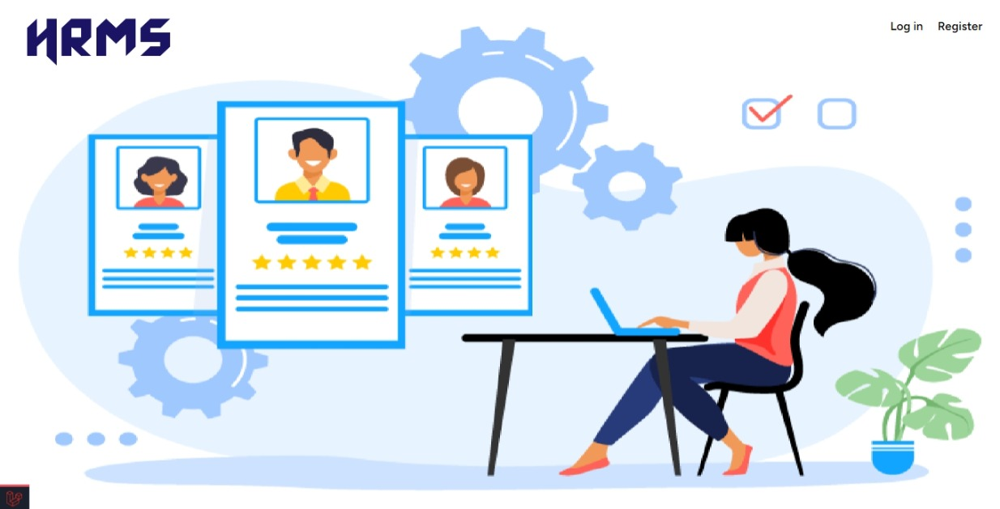

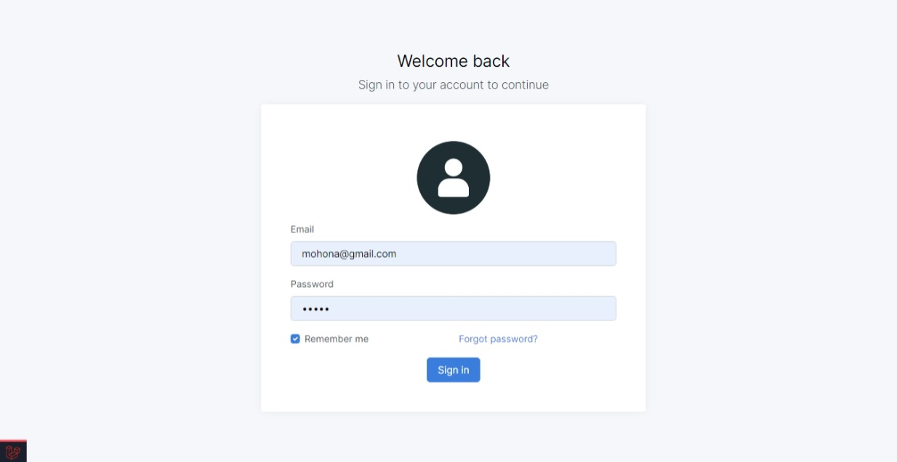

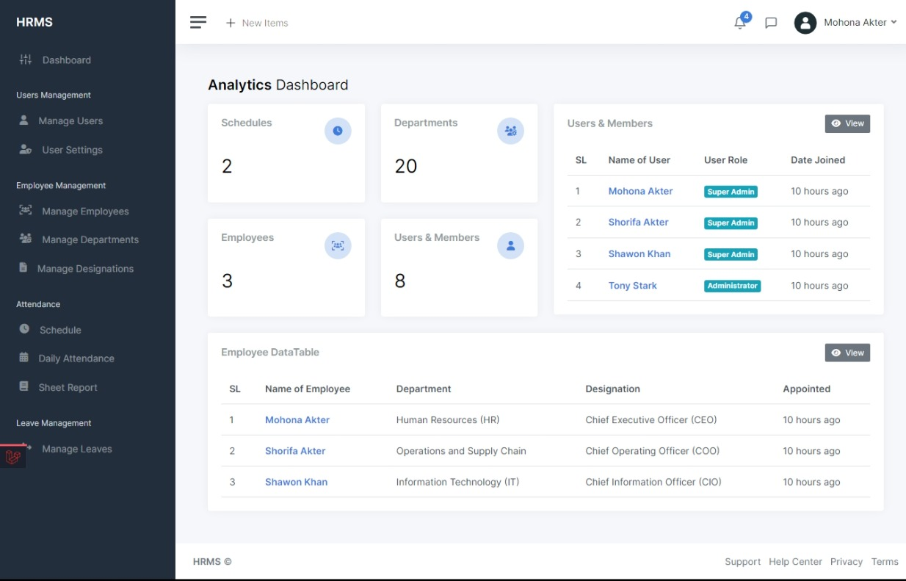

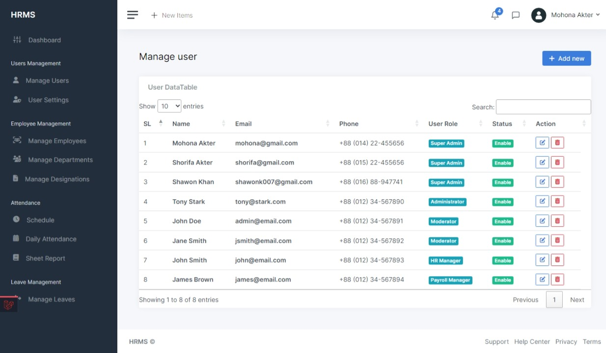

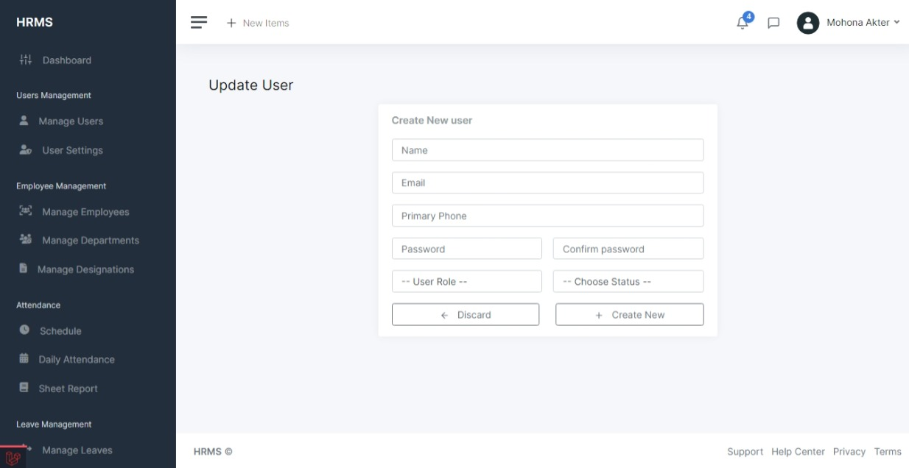

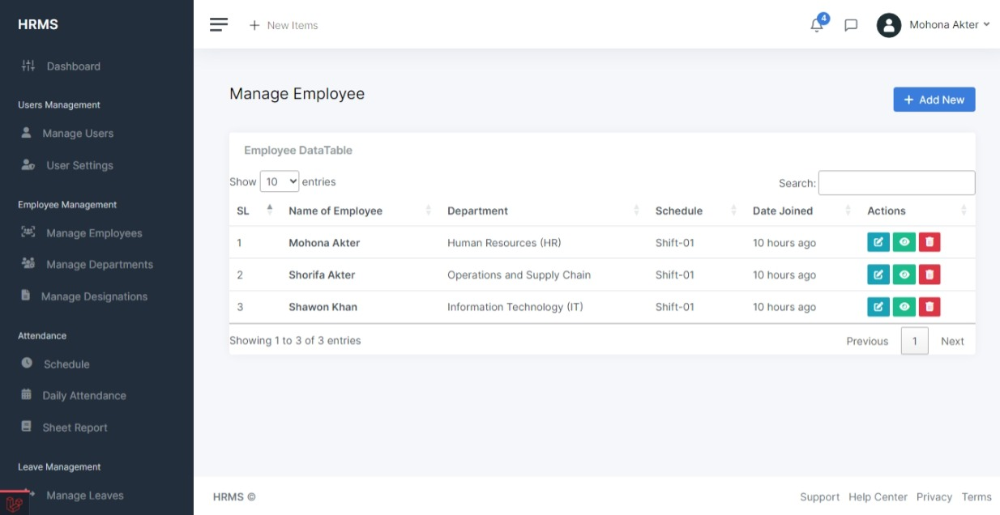

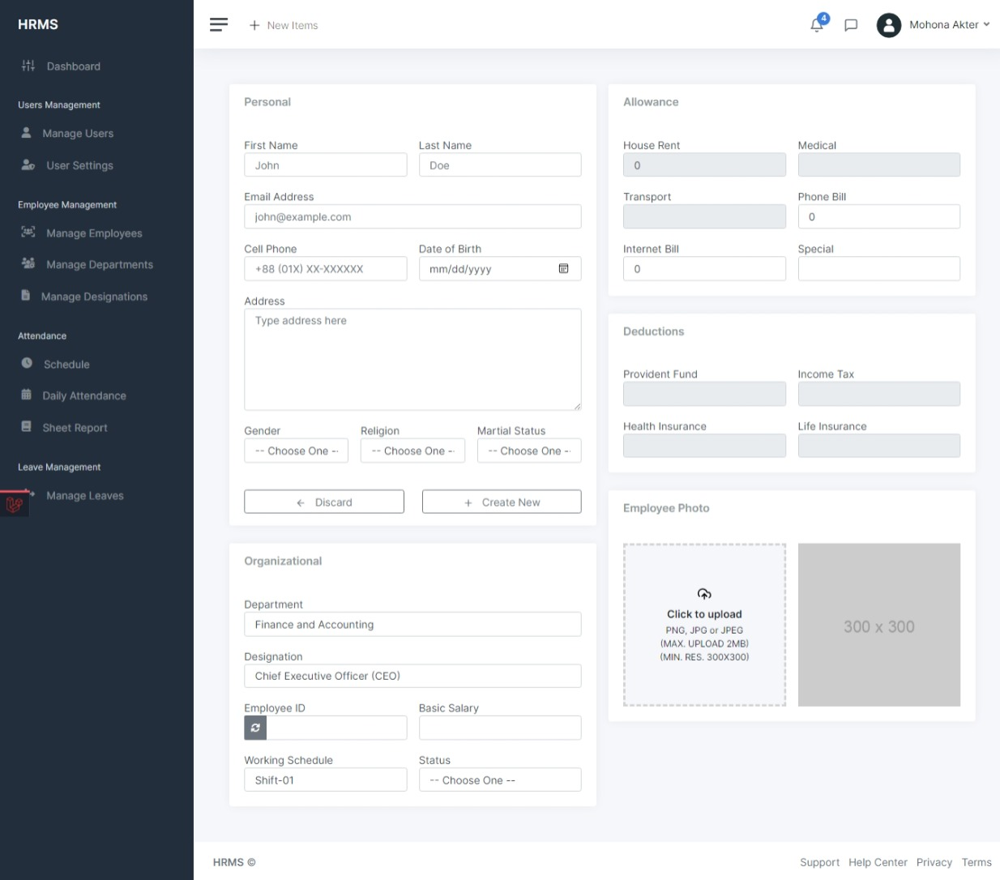

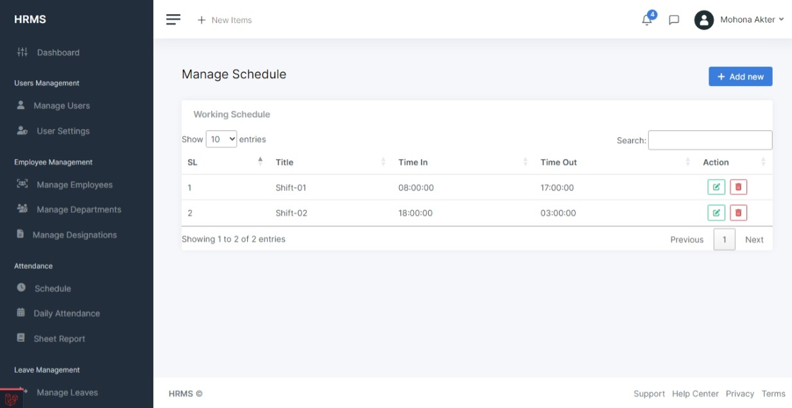

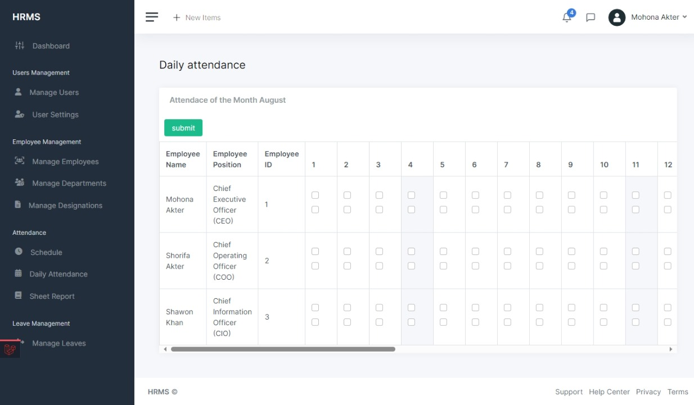

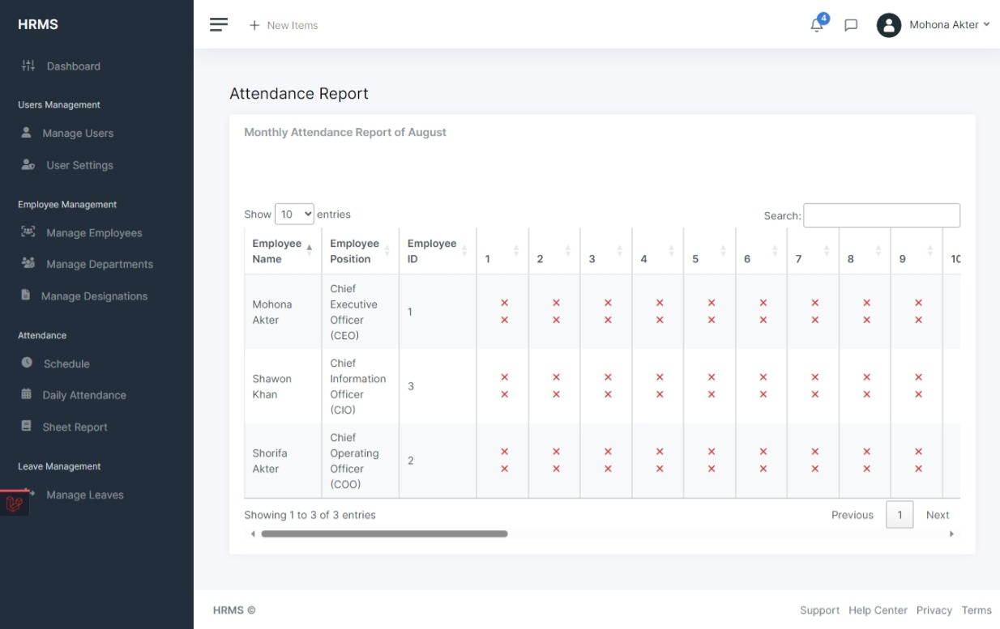

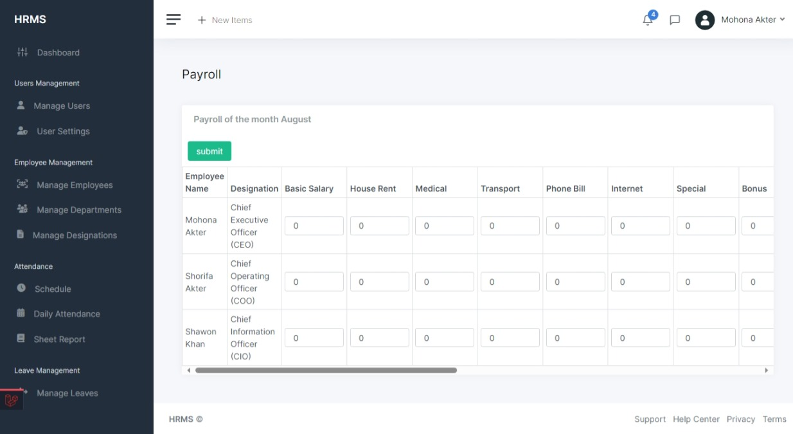

#### Prerequisites

Before you proceed, ensure you have the following software installed:

- PHP (Version 8.2)
- Composer (Version 2.5)
- MySQL (Version 8.2)
- Laravel (Version 10.16)

#### Installation

01. Clone the **Employee Management System** repository to your local machine using the following command:
```bash
git clone 
```

02. Navigate to the project directory:
```bash
cd employee-management-system
```

03. Install the required `PHP` dependencies using Composer:
```bash
composer install
```

04. Install `Node.js` dependencies
###### Using npm:
```bash
npm install
```
or,
###### using Yarn:
```bash
yarn
```

05. Generate `Vite` serve manifest:
###### Using npm:
```bash
npm run build
```
or,
###### using Yarn:
```bash
yarn build
```

06. Create a new MySQL database for Employee Management System and update the `.env` file with your database credentials:
```bash
cp .env.example .env
```

07. Generate a unique application key:
```bash
php artisan key:generate
```

08. Run the database migrations and seed the database with initial data:
```bash
php artisan migrate --seed
```

09. Start the development server:
```bash
php artisan serve
```

Congratulations! Employee Management System should now be up and running at `http://localhost:8000`.


